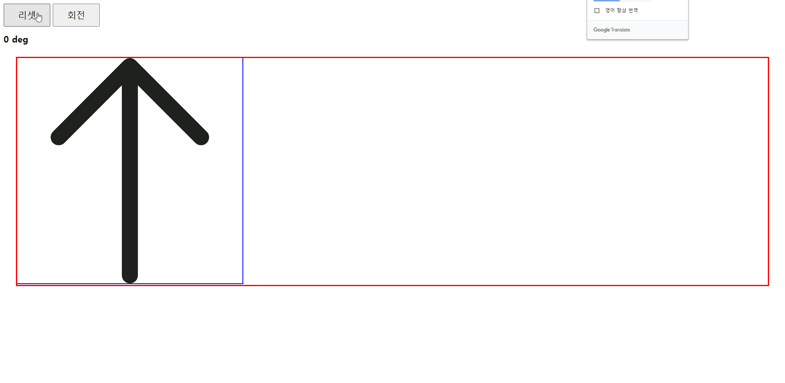

```html
<style>
        /* body 를 넘어가면 숨겨진다 */
        body {
            overflow: hidden;
        }
        /* h1 글씨 크기 */
        h1 {
            font-size: 20px;
        }
        /* 버튼의 글씨 크기, 세로10 가로30, 커서모양은 포인터 */
        button {
            font-size: 20px;
            padding: 10px 30px;
            cursor: pointer;
        }
        /* 바깥쪽 넓이 30 */
        .arrowWrap {
            margin: 30px;
            outline: 3px red solid;
        }
        /* transform 움직임(translate, rotate, scale, skew 등) 이 일어날때 모션속도를 조정한다 */
        /* 이미지의 넓이를 30% */
        .arrowWrap img {
            transition: transform 2s cubic-bezier(0.075, 0.82, 0.165, 1);
            width: 30%;
            outline: 2px solid blue;
        }
    </style>
    <!-- CSS 속도 설정도움 https://matthewlein.com/tools/ceaser -->
    <script>
        window.onload = function () {
            // 리셋 버튼
            var resetBtn = document.querySelector('.resetBtn')
            // 스타트 버튼
            var startBtn = document.querySelector('.startBtn')
            // 회전 값을 표시하기 위한 h1 태그
            var h1 = document.getElementsByTagName('h1')[0]
            // 화살표 영역
            var arrow = document.querySelector('.arrow');
            // 회전 값
            var rotateNum = 0;
            
            // 리셋 버튼을 누르면 회전의 값을 0으로 돌려놓는다
            resetBtn.addEventListener('click', function () {
                rotateNum = 0
                h1.innerHTML = `${rotateNum} deg`;
                arrow.style.transform = `rotate(${rotateNum}deg)`;
            })
            // 시작 버튼을 누르면 0~720 까지의 랜덤으로 나온 숫자로 회전한다 (360도만 주며 1번도 회전을 하지 않기 때문)
            startBtn.addEventListener('click', function () {
                // 랜덤
                rotateNum = Math.round(Math.random() * 720)
                // 랜덤숫자를 보여주기 위함
                h1.innerHTML = `${rotateNum} deg`;
                // 회전 css 적용
                arrow.style.transform = `rotate(${rotateNum}deg)`;
            })
        }
    </script>
```


