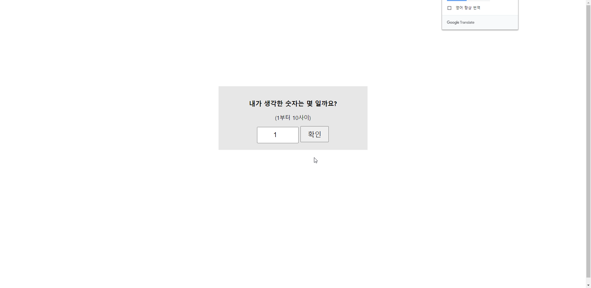

```html
<style>
        body {
            height: 100vh
        }
        .contWrap {
            position: relative;
            width: 400px;
            background: #e6e6e6;
            padding: 20px;
            top: 40%;
            left: 50%;
            transform: translate(-50%, -50%);
            text-align: center;
        }
        input {
            padding: 10px 20px;
            font-size: 20px;
            text-align: center;
            max-width: 170px;
        }
        button {
            font-size: 20px;
            padding: 8px 20px;
        }
    </style>

    <script>
        // body 가 모두 준비가 될 때 실행
        window.onload = function () {
            var input = document.getElementsByTagName('input')[0]
            var result = document.querySelector('.result')
            var button = document.querySelector('.startBtn')

            // 정답체크 함수
            function resultFunc() {
                // value 는 인풋박스 값
                var value = input.value
        
                // 만약 인풋값이 randomNum 숫자보다 작은 경우 '업▲' 텍스트를 화면에 보여준다
                if (value < randomNum) {
                    result.innerHTML = resultArr[0]
                // 만약 인풋값이 randomNum 숫자보다 큰 경우 '다운▼' 텍스트를 화면에 보여준다
                } else if (value > randomNum) {
                    result.innerHTML = resultArr[1]
                // 그 외 (작지도 크지도 않은 경우는 값이 일치하는 경우 '정답' 텍스트를 화면에 보여준다)
                } else {
                    result.innerHTML = resultArr[2]
                }
            }
            
            // 버튼 클릭 시 결과체크함수를 실행한다
            button.addEventListener('click', function () {
                resultFunc()
            })
            
            // 결과체크 후 보여줄 텍스트 배열
            var resultArr = ['업▲', '다운▼', '정답!']
            // 랜덤으로 생성되는 숫자 (1~10까지) - 새로고침 시 변경됨 
            var randomNum = Math.round(Math.random() * 9)+1
            console.log('random=' + randomNum)
        }
    </script>
```

