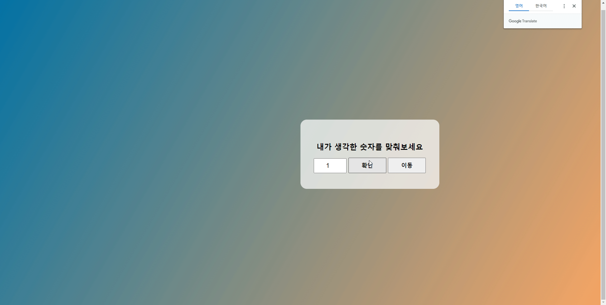

```html
<style >
        body {
            /* body 의 크기를 100vh 로 잡는다 */
            height: 100vh;
            /* 배경색에 그라데이션을 준다 */
            background: linear-gradient(120deg, #0272a4, #f6a564);
        }

        .contWrap {
            /* position:relative, top:40%, left:50%, transform(-50%,-50%) 은 가운데 맞추기이다 */
            position: relative;
            transform: translate(0, 0);
            top: 40%;
            left: 50%;
        
            /* 감싸는 영역 크기및 색 설정 모서리 둥글게 */
            width: 400px;
            background: rgba(255, 255, 255, .7);
            padding: 50px 20px;
            transition: transform 2s ease;
            text-align: center;
            border-radius: 20px;
        }
        
        
        input {
            padding: 10px 20px;
            font-size: 20px;
            text-align: center;
            max-width: 60px;
        }

        button {
            font-size: 18px;
            font-weight: bold;
            padding: 10px 40px;
        }
    </style>
    <script>

        // 변수, 조건문 if, 배열, setTimeout
        window.onload = function () {
            var input = document.getElementsByTagName('input')[0];
            var result = document.querySelector('.result')
            var button = document.querySelector('.startBtn')
            var contWrap = document.querySelector('.contWrap')
            var transitionBtn = document.querySelector('.transitionBtn')

            // 이동 버튼 클릭 시 translate 로 이동
            transitionBtn.addEventListener('click', function () {
                contWrap.style.transform = 'translate(-50%,-50%)'
            })
        
            // 확인 버튼 클릭 시 결과 체크함수 실행
            button.addEventListener('click', function () {
                resultFunc()
            });
        
            // 결과 담긴 배열
            var resultArr = ['업▲', '다운▼', '정답!']

            // 결과로 설정 될 랜덤숫자 설정
            var randomNum = Math.round(Math.random() * 9) + 1

            // 결과 체크 함수
            function resultFunc() {
                // 인풋 값
                var value = input.value

                // 만약 랜덤숫자값보다 작으면 위 출력 낮으면 아래 출력 그 외에는 정답 alert 창 표시
                if (value < randomNum) {
                    result.innerHTML = resultArr[0]
                } else if (value > randomNum) {
                    result.innerHTML = resultArr[1]
                } else {
                    result.innerHTML = resultArr[2]
                    alert('정답');
                     
                    // alert 창을 닫으면 1초 후에 리셋을 실행한다
                    setTimeout(function () {
                        resetFunc()
                    }, 1000);
                }
    
                // 리셋 함수
                // 랜덤 숫자를 재설정하고, 인풋값을 1로 설정 등등...
                function resetFunc() {
                    input.value = 1
                    result.innerHTML = '한판더! (1부터 10사이 정수)'
                    randomNum = Math.round(Math.random() * 9) + 1
                    console.log(randomNum)
                }
            }
        }
    </script>
```

