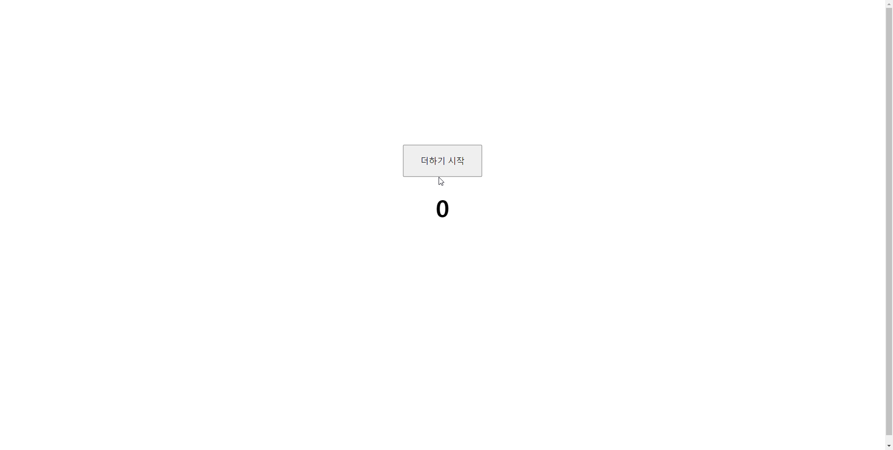

```html
 <style>
        body {
            height: 100vh;
        }

        .contWrap {
            position: relative;
            left: 50%;
            top: 40%;
            transform: translate(-50%, -50%);
            text-align: center;
        }

        button {
            font-size: 18px;
            padding: 20px 35px;
        }

        h1 {
            font-size: 50px;
        }
    </style>
    <script>
        window.onload = function () {
            var startBtn = document.querySelector('.startBtn')
            var num = document.querySelector('.num')

            let timer;

            // 시작 버튼 클릭 시 사용자 정의 함수 interval() 을 실행한다
            startBtn.addEventListener('click', function () {
                interval()
            })
    
            // 첫번째 실행 할 때는 clearInterval(timer) 를 해도 소용없지만, 2번째 부터는 작동중인 timer 를 초기화한다 
            // 안그러면 누를 때 마다 계속 실행되서 secNum 올라가는 속도가 빨라보이게 된다  (많이 실행하게 되서 빨라 보이는 것 뿐이지 속도가 빠른거 아님)
            function interval() {
                clearInterval(timer)
                // 버튼을 클릭 할 때 마다 0부터 시작하기 위해 0으로 설정한다
                let secNum = 0
   
                // 미리 만들어진 timer 변수에 setInterval 인스턴스를 넣어준다
                timer = setInterval(function () {
                    
                    // 한번 호출 될 때 마다 1씩 증가 한다
                    secNum++
                    // 1씩 증가 된 secNum 을 num 요소의 값으로 한다
                    num.innerHTML = secNum
                // 0.01초 마다
                }, 10)
            }
        }
    </script>
```

