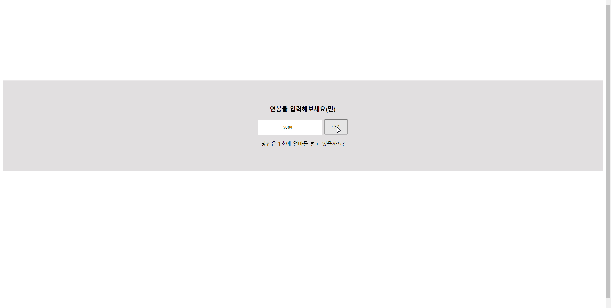

```html
    <style>

        body {
            height: 100vh;
        }

        .contWrap {
            position: relative;
            left: 50%;
            top: 40%;
            padding: 60px;
            background: #e2dfdf;
            transform: translate(-50%, -50%);
            text-align: center;
        }

        input {
            padding: 15px;
            text-align: center;
        }

        button {
            font-size: 15px;
            padding: 12px 20px;
        }
    </style>
    <script>
        window.onload = function () {
            var btn = document.querySelector('.startBtn')
            var inp
            var sec = document.querySelector('.sec')
            var money
            var div
            var secMoney
            var timer
    
            // interval 사용자 정의 함수
            function interval() {
                // 호출 시 timer=interval 을 초기화한다
                clearInterval(timer)
                // s = 초
                var s = 0
                // timer = interval
                timer = setInterval(function () {
                    // 1초마다 s 를 1씩 증가 시킨다
                    s++
                    // (초 * 1년연봉/365/24/60/60) 한 값의 소숫점 1의 자리까지 표시 
                    sec.innerHTML = `당신은 ${s}초에 ${(s*secMoney).toFixed(1)}원을 벌고 있습니다`
                }, 1000)
            }
            
            // btn 클릭 시 inp 요소를 가져온다,
            // money 는 inp 요소 값의 * 10000 을 곱한다
            // 나누는 값은 3600(1시간)*24시간*365일 이다
            // 1초당 머니는 money / div 가 된다
            btn.addEventListener('click', function () {
                inp = document.querySelector('input')
                money = inp.value * 10000
                div = 3600 * 24 * 365
                secMoney = money / div
                interval()
            })
        }
    </script>
```


