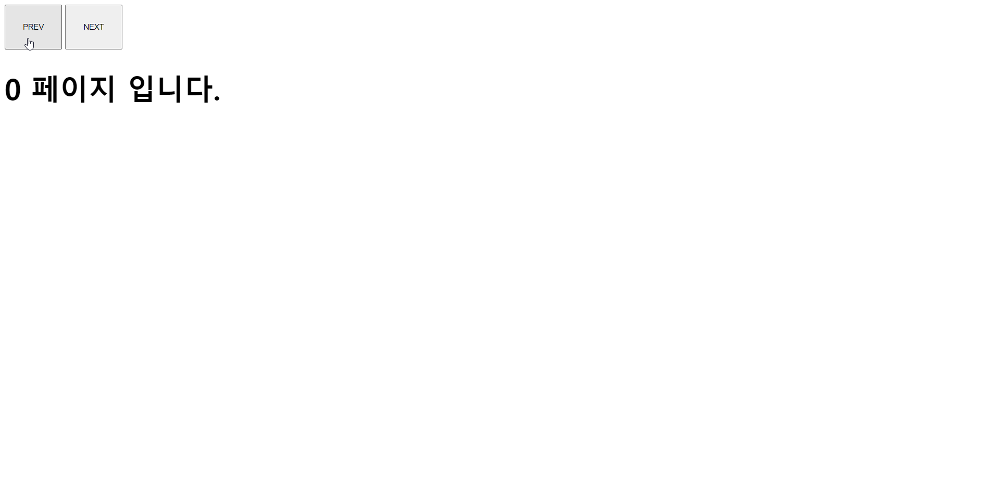

```html
<style>
        h1 {
            font-size: 50px;
            font-weight: bold;
        }

        button {
            cursor: pointer;
            padding: 30px;
        }
    </style>
    <script>
        window.onload = function () {
            var prevBtn = document.querySelector('.prevBtn')
            var nextBtn = document.querySelector('.nextBtn')
            var h1 = document.getElementsByTagName('h1')[0]

            // 현제 페이지의 넘버
            var pageNum = 0
            // 전체 페이지의 넘버
            var totalNum = 3

            // 이전 버튼 클릭 시, 현재 페이지의 넘버가 0보다 크면 현재 페이지의 넘버를 -1 한다
            // 아닌 경우 전체 페이지 넘버 - 1 을 한다. 즉, 현재페이지가 0일 때 누르면 맨 마지막페이지로 이동한다
            prevBtn.addEventListener('click', function () {
                if (pageNum > 0) {
                    pageNum--
                } else {
                    pageNum = totalNum - 1
                }
                h1.innerHTML = pageNum + ' 페이지 입니다'
            });

            // 다음 버튼 클릭 시, 현재 페이지 넘버가 전체페이지-1 보다 작은 경우 현재 페이지의 넘버를 +1 한다
            // 아닌 경우 현재 페이지 넘버를 0으로 한다. 즉, 현재 페이지가 맨 마지막페이지 일 때 누르면 처음페이지로 이동한다
            nextBtn.addEventListener('click', function () {
                if (pageNum < totalNum - 1) {
                    pageNum++
                } else {
                    pageNum = 0
                }
                h1.innerHTML = pageNum + ' 페이지 입니다'
            });
        }
    </script>
```


