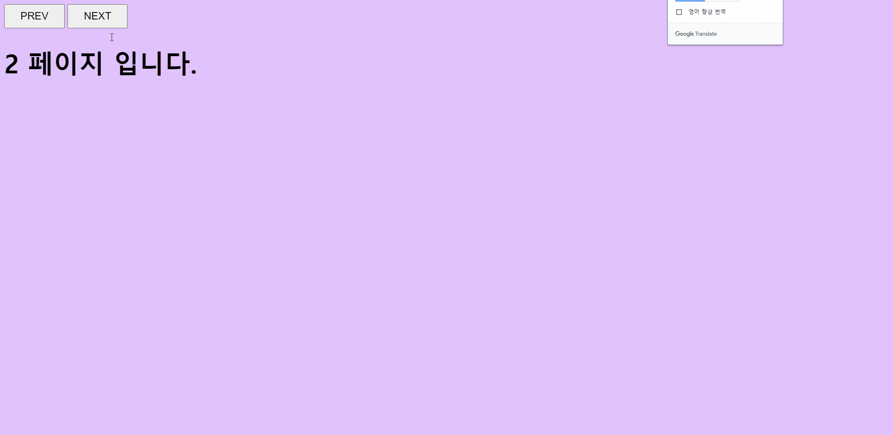

```html
    <style>
        /* body 의 background 변화 시 트랜지션을 2.5s 준다 */
        body {
            transition: background 2.5s cubic-bezier(0.075, 0.82, 0.165, 1);
        }
    
        h1 {
            font-size: 50px;
            font-weight: bold;
        }
    
        button {
            font-size: 20px;
            padding: 10px 30px;
            cursor: pointer;
        }
    </style>
    <script>
        window.onload = function () {
            var preBtn = document.querySelector('.preBtn')
            var nextBtn = document.querySelector('.nextBtn')
            var h1 = document.getElementsByTagName('h1')[0]
            
            // 배경색 배열
            var bgColorArr = ['#85FFBD', '#FFFB7D', '#E0C3FC', '#00DBDE']

            // 윈도우 로드시 현재 페이지 번호를 배경색 배열의 개수만큼 랜덤한 수를 현재 페이지 번호로 설정한다
            // 3이 나온다면 현재 페이지는 3으로 설정되고, 배경색도 3번째 위치한 '#E0C3FC' 이 된다
            var pageNum = Math.round(Math.random() * (bgColorArr.length - 1))
        
            // 전체 페이지는 배경색의 배열의 수만큼 갖게 한다
            var totalNum = bgColorArr.length
    
            // 이전 버튼 클릭 시 배경색 변경 사용자 함수 실행
            preBtn.addEventListener('click', function() {
            
                // 삼항연산자를 이용하여 현재 페이지가 0보다 크면 이전 버튼클릭 시 현재페이지를 줄일 수 있게 하고
                // 그게 아니라면 즉, 0이라면 이전 버튼 클릭 시 맨 마지막 페이지로 이동하게 끔 설정한다
                pageNum > 0 ? pageNum-- : pageNum = totalNum - 1
    
                bgColorChange()
            });
            
            // 다음 버튼 클릭 시 배경색 변경 사용자 함수 실행
            nextBtn.addEventListener('click', function () {
            
                // 삼항연산자를 이용하여 현재 페이지가 전체 페이지보다 작다면 다음 버튼클릭 시 현재 페이지를 더하고
                // 그게 아니라면, 즉 현재 페이지가 마지막 페이지라면, 다음 버튼 클릭 시, 맨 처음 페이지 인 0으로 설정한다  
                pageNum < totalNum - 1 ? pageNum++ : pageNum = 0
    
                bgColorChange()
            });
    
            // 윈도우가 로드 될 때, 배경색 변경을 한 번만 실행한다. (init)
            bgColorChange()
            
            // 배경색 변경 함수
            function bgColorChange() {
                h1.innerHTML = pageNum + ' 페이지 입니다.'

                // body 의 배경색을 bgColorArr 배열의 현재페이지번호 번째에 있는 색으로 지정한다
               document.getElementsByTagName('body')[0].style.backgroundColor = bgColorArr[pageNum]
            }
        }
    </script>
```
